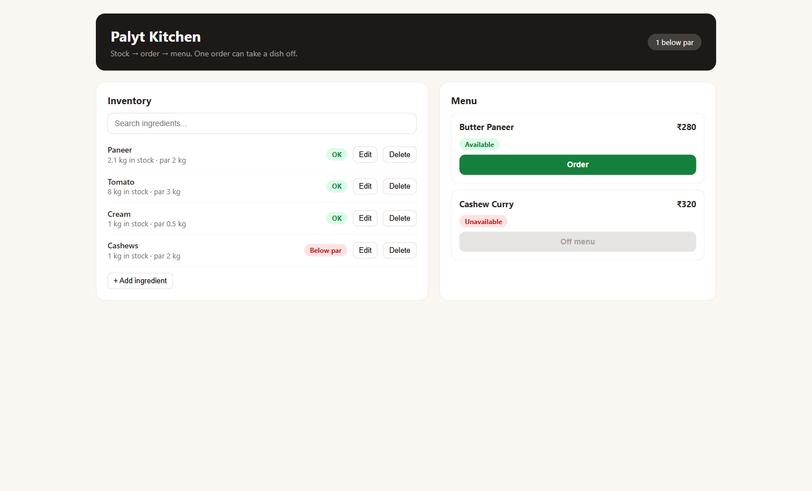
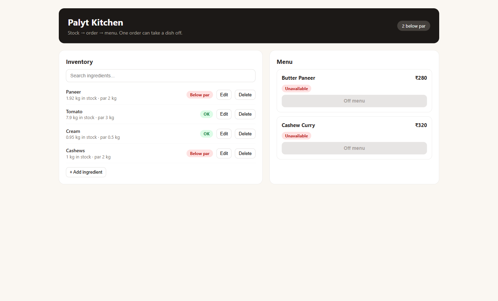
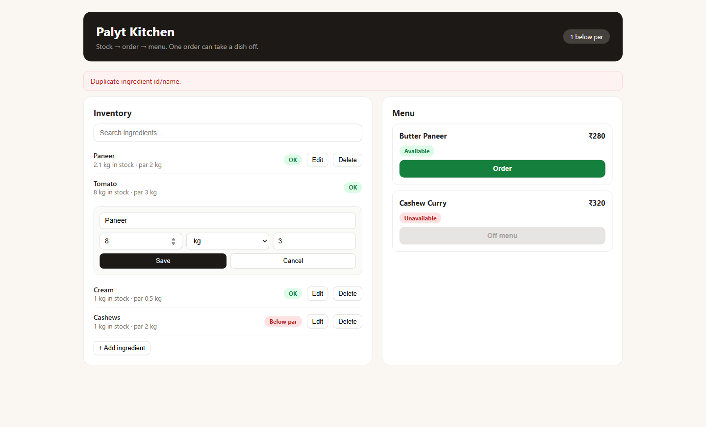

# Palyt Kitchen

Stock → order → menu loop. A diner orders a dish, recipe quantities leave stock,
and dishes below par come off the menu. Inventory and menu sit side by side so you can
watch it happen.

- **Repo:** https://github.com/ramakrishna-rk7/palyt-kitchen
- **Open PR (write-up lives there):** https://github.com/ramakrishna-rk7/palyt-kitchen/pull/1

## Demo — one order takes a dish off the menu

Before: Paneer 2.1 kg (par 2 kg), Butter Paneer Available.



One click on Order deducts 180 g paneer + 100 g tomato + 50 g cream.
Paneer drops to 1.92 kg, below par, and Butter Paneer goes off menu.



## Run the page

```
npm install
npm run dev     # open http://localhost:5173
```

## Run the tests

```
npm run test    # vitest, 10 tests
```

## Features

- Inventory list with quantity + par, OK / Below par pills, search.
- Add ingredient, edit quantity/par (deliveries, par changes), delete ingredient.
- Menu with prices and Available / Unavailable status; unavailable dishes can't be ordered.
- Order deducts every recipe ingredient with unit conversion and refreshes the menu instantly.
- Restocking brings dishes back; raising par removes them with no order.

## Business rules

- Dish available only if **every** ingredient has `stock >= par`. Exactly at par = available.
- Missing ingredient in a recipe = unavailable (fail closed).
- Delete blocked when a recipe uses the ingredient (e.g. cashews); unused ones (e.g. bay leaves) delete cleanly.
- Validation: name required, stock ≥ 0, par > 0, unit in kg/g/l/ml/pcs, no duplicates.
  Unit is fixed on edit (changing kg→g without converting 5 kg to 5000 g would corrupt data).
  Renaming onto an existing name is blocked too:



## Design decisions

- Delete refusal over silent cleanup: deleting a referenced ingredient would leave recipes
  pointing at nothing, so the app names the dishes instead.
- Units normalized to base (kg→g, l→ml) before compare/deduct, converted back after;
  unknown units throw rather than guess (a 1000× error is worse than an error message).
- **Rule challenge:** par-based availability puts 1.92 kg of paneer (~10 portions) off menu.
  Par means "reorder", not "can't cook". Better: unavailable when `stock < one portion`,
  par drives a reorder alert. Implemented the brief's rule, flagging this.

## How checked

- 10 Vitest tests: above/below/exactly-at-par, missing ingredient, unit factors,
  5 kg − 180 g = 4.82 kg, multi-ingredient deduct, full order → 1.92 kg → unavailable,
  restock / par-raise flip both ways.
- Hand calc: 2100 g − 180 g = 1920 g = 1.92 kg < 2 kg par. Matches.
- Browser click-through with the screenshots above.
- Blind spot: tests share the code's factor table, so the hand calc + browser check cover it.

## Another day

Real 15-row data, reorder alert separate from availability, persistence, order history.
Out of scope on purpose.

## Files

- `src/App.jsx` — inventory + menu UI, one file
- `src/logic.js` — `toBase`, `isDishAvailable`, `deductIngredients`
- `src/stock.json`, `src/recipes.json` — small stand-ins, same shape as the brief; drop real files in
- `src/logic.test.js` — 10 tests
- `docs/` — before/after screenshots
